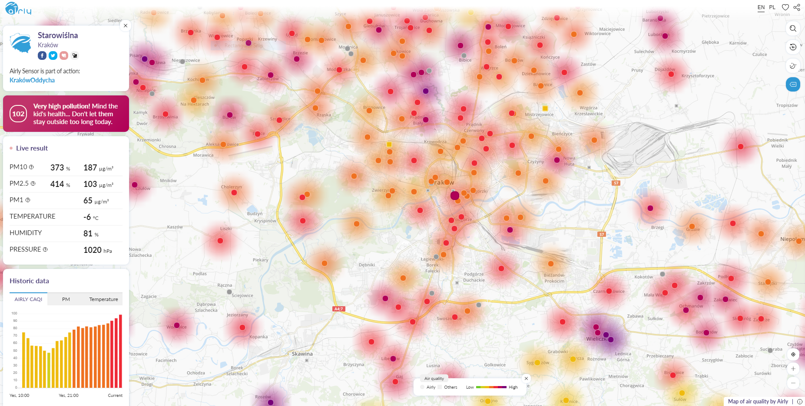

# Airguard

This platform is a personal project for monitoring and processing air pollution data obtained from
a network of sensors owned and maintained by https://airly.eu, which I am not affiliated with in any way.
Data is harvested from the API published by the company at https://developer.airly.eu and remains
the property of Airly sp. z o.o., Kraków, Poland.

The platform is intended to be deployed using various Amazon Web Services. Due to the focus of the project
being education and experimentation, some solutions may seem overengineered if you're browsing through
the code. You're welcome to use any and all parts of it in whatever manner you see fit, as long as you
adhere to Airly's [Terms of Service](https://airly.eu/docs/tos-en.pdf) and appropriate usage limits
when using their API.

### Problem statement

My home city of Kraków has been suffering for a long time from high levels of air pollution, specifically
particulate matter (PM2.5/PM10). The problem is mainly caused by emissions from outdated heating systems
in the winter, and compounded by the city's unfavourable location in a geological basin, where the surrounding
hills limit airflow throughout the city. The battle to mitigate that problem is being fought on several fronts,
one of which is education and information. To that end, a startup named Airly arose in the late 2016,
with the aim of developing and deploying a fine-grained network of low-cost, network-enabled pollution sensors,
data from which would be easily accessible to general public in real time. Today, Airly has more than 2000 sensors
across Poland, and is starting its expansion to foreign cities.

  
  
Kraków and the surrounding area on a bad winter day

Despite the Airly network being a great early warning system, they only publish live data coupled with
the history for the past 24 hours. According to their marketing team, they currently have no plans to share
historic data for more significant periods of time. It is therefore impossible for me to achieve three things
which I'd very much like to do:

* identify hotspots that are persistent rather than temporary, whether through heavier emissions
in the neighbourhood or unfavourable terrain structure
* similarly, identify possible "green islands" within the city bounds
* conduct data mining to investigate correlation between pollution level and wind speed, temperature, humidity etc.

The obvious solution is to host my own harvesting bot that would periodically connect to Airly's API and retrieve
data for a subset of sensors within the area of interest (depending on the usage limits that the API allows).
